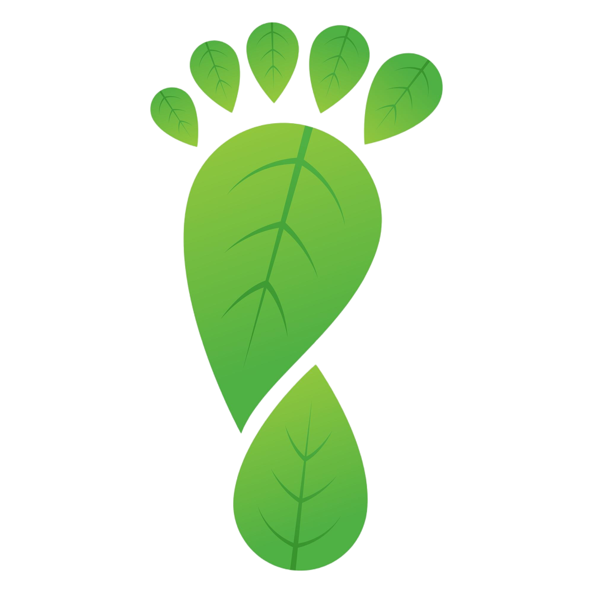

<!-- Improved compatibility of back to top link: See: https://github.com/othneildrew/Best-README-Template/pull/73 -->
<a id="readme-top"></a>
<!--
*** Thanks for checking out the Best-README-Template. If you have a suggestion
*** that would make this better, please fork the repo and create a pull request
*** or simply open an issue with the tag "enhancement".
*** Don't forget to give the project a star!
*** Thanks again! Now go create something AMAZING! :D
-->


<!-- PROJECT SHIELDS -->
<!--
*** I'm using markdown "reference style" links for readability.
*** Reference links are enclosed in brackets [ ] instead of parentheses ( ).
*** See the bottom of this document for the declaration of the reference variables
*** for contributors-url, forks-url, etc. This is an optional, concise syntax you may use.
*** https://www.markdownguide.org/basic-syntax/#reference-style-links
-->
<div align="center">
  <a href="https://medium.com/@yassinezamit26">
    
  </a>
  <a href="https://www.youtube.com/c/@automationworld8336">
    
  </a>
    <a href="https://www.linkedin.com/in/yassine-zamit/">
    
  </a>

</div>


<!-- PROJECT LOGO -->
<br />
<div align="center">
  <a href="https://github.com/othneildrew/Best-README-Template">
    
  </a>

  <h3 align="center">Carbon FootPrint Analysis </h3>

  <p align="center">
    A comprehensive analysis of carbon emissions data, enhanced with interactive visualizations and actionable insights.
    <br />
        <a href="https://github.com/yassineeea/Pizza-Sales-Analysis/blob/main/KPIreport.docx"><strong>Explore the docx »</strong></a>
    <br />
    <br />
    
    
  </p>
</div>


<!-- TABLE OF CONTENTS -->
<details>
  <summary>Table of Contents</summary>
  <ol>
    <li>
      <a href="#about-the-project">About The Project</a>
      <ul>
        <li><a href="#built-with">Built With</a></li>
      </ul>
    </li>
    <li>
      <a href="#Problem Statement">Problem Statement</a>
      <ul>
        <li><a href="#KPI requirements">KPI requirements</a></li>
        <li><a href="#CHARTS REQUIREMENT">CHARTS REQUIREMENT</a></li>
      </ul>
    </li>
    <li><a href="#Project Workflow">Project Workflow</a>
      <ul>
        <li><a href="#Data Collection and Preparation">Data Collection and Preparation</a></li>
              <ul>
                 <li><a href="#Data Source">Data Source</a></li>
                 <li><a href="#Data Cleaning">Data Cleaning</a></li>
              </ul>
      </ul>
      <ul>
        <li><a href="#Data Analysis with SQL">Data Analysis with SQL</a></li>
              <ul>
                 <li><a href="#KPI Calculation">KPI Calculation</a></li>
                 <li><a href="#Trend Analysis">Trend Analysis</a></li>
              </ul>
      </ul>   
      <ul>
        <li><a href="#Data Visualization with Power BI">Data Visualization with Power BI</a></li>
              <ul>
                 <li><a href="#Dashboard Creation">Dashboard Creation</a></li>
              </ul>
      </ul> 
      <ul>
        <li><a href="#Business Insights and Reporting">Business Insights and Reporting</a></li>
      </ul>         
    </li>
    <li><a href="#contact">Contact</a></li>
  </ol>
</details>


<!-- ABOUT THE PROJECT -->
## About The Project 📚


[](https://example.com)


The Carbon Footprint Analysis project was designed to explore and understand global carbon emissions trends, focusing on the contributions of various countries and energy sources. By analyzing an extensive dataset of CO2 emissions, this project aimed to uncover insights that could inform policy decisions, guide sustainable practices, and support efforts to mitigate climate change.


#### Goals 🎯
* Identify Top Contributors 🥇: Determine which countries and energy sources contribute most to total carbon emissions.
* Analyze Emissions Trends 📈: Understand the annual, regional, and global trends in carbon emissions to support informed decision-making.
* Insights on Carbon Intensity 🌍: Assess the relationship between carbon emissions and economic output (GDP) to evaluate the efficiency of different countries in managing their carbon footprint.


### Built With ⛏️🧑🏽‍💻
To navigate the data analyst job market, I enlisted a powerful toolkit:

- **[![SQL][SQL-badge]][SQL-url]** served as the foundation, enabling me to explore and clean database to extract valuable insights.
- **[![Microsoft SQL Server Management Studio][SSMS-badge]][SSMS-url]** Provided a familiar environment for database interaction and executing SQL queries.
- **[![Power BI][PowerBI-badge]][PowerBI-url]** Utilized for creating interactive dashboards.
- **[![Git][Git-badge]][Git-url] [![GitHub][GitHub-badge]][GitHub-url]** ensured seamless version control and collaboration by allowing me to track changes and share my SQL scripts and analysis.


<!-- Badges and URLs -->
[SQL-badge]: https://img.shields.io/badge/SQL-MySQL-orange
[SQL-url]: https://www.mysql.com/

[Jupyter-badge]: https://img.shields.io/badge/Jupyter%20Notebook-F37626.svg?logo=jupyter&logoColor=white
[Jupyter-url]: https://jupyter.org/

[SSMS-badge]: https://img.shields.io/badge/SQL%20Server-CC2927?logo=microsoft-sql-server&logoColor=white
[SSMS-url]: https://docs.microsoft.com/en-us/sql/ssms/sql-server-management-studio-ssms

[Git-badge]: https://img.shields.io/badge/Git-F05032.svg?logo=git&logoColor=white
[Git-url]: https://git-scm.com/

[GitHub-badge]: https://img.shields.io/badge/GitHub-181717.svg?logo=github&logoColor=white
[GitHub-url]: https://github.com/

[PowerBI-badge]: https://img.shields.io/badge/Power%20BI-F2C811.svg?logo=power-bi&logoColor=black
[PowerBI-url]: https://powerbi.microsoft.com/

<p align="right">(<a href="#readme-top">back to top</a>)</p>


<!-- Problem Statement -->
## Problem Statement 📝
We need to analyze the carbon footprint data for various countries over time to gain insights into global and regional carbon emissions trends. Specifically, we want to calculate the following key metrics:
### 1. KPI requirements 📌
We need to analyze key indicators of carbon emissions data to gain insights into our business performance. Specifically, we want to calculate the following metrics:
- **Total Carbon Emissions:** The sum of all CO2 emissions from various sources (e.g., cement, coal, gas, oil).
- **Per Capita Carbon Emissions:** Compute the average carbon emissions per person by dividing the total carbon emissions by the population of each country.
- **Energy Consumption by Source:** Analyze the total energy consumption from various sources (e.g., coal, gas, oil) for each country and year
- **Carbon Intensity of GDP:**  The amount of carbon emissions per unit of GDP, calculated by dividing total carbon emissions by the GDP of each country.
- **Carbon Emissions Growth Rate:** The percentage change in total carbon emissions from one year to the next, to assess trends in carbon emissions over time.
  
### 2. CHARTS REQUIREMENT 📊
We would like to visualize various aspects of our carbon footprint data to gain insights and understand key trends. The following charts will help us achieve this:
- **Annual Trend for Total Carbon Emissions:** Create a line chart that displays the yearly trend of total carbon emissions for each country. This chart will help us identify long-term trends and variations in carbon emissions.
- **Annual Trend of Carbon Emission Per Person:** A line chart to track the trend of per capita carbon emissions over the years, revealing patterns and changes in individual contributions to emissions.

- **Energy Consumption by Source:**  Pie charts or stacked bar charts depicting the breakdown of energy consumption by source (e.g., coal, gas, oil) for each country, offering insights into the primary contributors to carbon emissions.
  
- **Top/Bottom Countries with CO2 Emissions:** Bar charts comparing the CO2 emissions and CO2 emissions per capita across different countries, highlighting both the highest and lowest contributors.
- **CO2 Growth Per Country and Source:** Visualization to show the percentage contribution of CO2 growth by country and by energy source, identifying the main drivers of increasing emissions.


<!-- USAGE EXAMPLES -->
## Project Workflow 🚀


### 1. Data Collection and Preparation 🗂️

#### Data Source🌐: 
The data was collected from multiple global sources, including the Energy Institute and the U.S. Energy Information Administration, among others.
.[*Our World in Data*](https://ourworldindata.org/co2-and-other-greenhouse-gas-emissions)
#### Data Cleaning🧹:
To ensure the integrity and accuracy of the analysis, significant data cleaning steps were undertaken:

- **Handling Missing Values:**
A substantial portion of the data before 1859 had missing values. To maintain the reliability of the analysis, all records with dates earlier than 1859 were removed. This decision was made after careful consideration, as the presence of missing values could skew the results and lead to inaccurate insights.
```sql
DELETE FROM CarbonData
WHERE year < 1859;

```
- **Data Type Standardization:**
Ensured that all data fields, such as dates, emissions figures, and population counts, were correctly formatted. Numeric fields were checked for consistency, and any anomalies were corrected

### 2. Data Analysis with SQL 🔍

#### KPI Calculation📊:

I Wrote SQL queries to calculate the required KPIs such as Total Revenue, Average Order Value, Total Pizzas Sold, Total Orders, and Average Pizzas Per Order.
- **1. Total Carbon Emissions:** This query calculates the total CO2 emissions from various sources such as cement, coal, gas, oil, other industries, land use changes, and flaring.
```sql
SELECT 
    SUM(cement_co2 + coal_co2 + gas_co2 + oil_co2 + other_industry_co2 + land_use_change_co2 + flaring_co2) AS TotalCarbonEmission
FROM CarbonData;

```
- **2. Average Carbon Emission Per Person:** This query calculates the average carbon emissions per capita by dividing total CO2 emissions by the total population.
```sql
SELECT 
    SUM(cement_co2 + coal_co2 + gas_co2 + oil_co2 + other_industry_co2 + land_use_change_co2 + flaring_co2) / SUM(population) AS AverageIndivCarbonEmission
FROM CarbonData;

```
- **3. Total Carbon Emissions by Source:** This query calculates the total CO2 emissions for each source, including coal, gas, oil, other industries, land use changes, and flaring.
```sql
SELECT 
    SUM(coal_co2) AS TotalCoalConsumption,
    SUM(gas_co2) AS TotalGasConsumption,
    SUM(oil_co2) AS TotalOilConsumption,
    SUM(other_industry_co2) AS TotalOtherIndustryConsumption,
    SUM(land_use_change_co2) AS TotalLandUseChangeConsumption,
    SUM(flaring_co2) AS TotalFlaringConsumption
FROM CarbonData;

```
- **4. Carbon Intensity of GDP:** This KPI measures the carbon emissions per unit of GDP, calculated by dividing the total carbon emissions by the GDP of each country.
```sql
SELECT 
    (SUM(cement_co2 + coal_co2 + gas_co2 + oil_co2 + other_industry_co2 + land_use_change_co2 + flaring_co2) / SUM(gdp)) AS CarbonIntensityOfGDP
FROM CarbonData;

```

#### Trend Analysis📈:
I Used SQL to extract data for annual trends, enabling the creation of the necessary charts in Power BI.
- **1. Annual Trend for Total Carbon Emissions:** This query calculates the total carbon emissions for each country per year, allowing us to visualize the trend of carbon emissions over time.
```sql
SELECT year, country, 
    SUM(cement_co2 + coal_co2 + gas_co2 + oil_co2 + other_industry_co2 + land_use_change_co2 + flaring_co2) AS TotalCarbonEmission
FROM CarbonData
GROUP BY year, country
ORDER BY year, country;
```
- **2. Annual Trend of Carbon Emission Per Person:** This query calculates the average carbon emissions per person for each country per year.
```sql
SELECT year, country, 
    SUM(cement_co2 + coal_co2 + gas_co2 + oil_co2 + other_industry_co2 + land_use_change_co2 + flaring_co2) / SUM(population) AS PerCapitaEmission
FROM CarbonData
GROUP BY year, country
ORDER BY year, country;
```
- **3. Energy Consumption by Source:** This query breaks down the total energy consumption by source (e.g., coal, gas, oil) for each country and year, providing insights into which sources are the primary contributors to carbon emissions.
```sql
SELECT year, country, 
    SUM(coal_co2) AS CoalConsumption,
    SUM(gas_co2) AS GasConsumption,
    SUM(oil_co2) AS OilConsumption
FROM CarbonData
GROUP BY year, country
ORDER BY year, country;
```
- **4. Top/Bottom Countries with CO2 Emissions:** This query ranks countries based on their total CO2 emissions, identifying the highest and lowest contributors to global emissions.
```sql
SELECT country, 
    SUM(cement_co2 + coal_co2 + gas_co2 + oil_co2 + other_industry_co2 + land_use_change_co2 + flaring_co2) AS TotalCarbonEmission
FROM CarbonData
GROUP BY country
ORDER BY TotalCarbonEmission DESC;
```
### 3. Data Visualization with Power BI 📊
The Carbon Footprint Dashboard provides a comprehensive view of carbon emissions data across various dimensions.
- **Key DAX Measures** To create these visualizations and insights, several DAX measures were implemented in Power BI:
  
Total Carbon Emissions:
```dax
Total Carbon Emissions = 
SUM(CarbonData[cement_co2]) + 
SUM(CarbonData[coal_co2]) + 
SUM(CarbonData[gas_co2]) + 
SUM(CarbonData[oil_co2]) + 
SUM(CarbonData[other_industry_co2]) + 
SUM(CarbonData[land_use_change_co2]) + 
SUM(CarbonData[flaring_co2])
```
Average Carbon Emissions Per Person:
```dax
Average Carbon Emissions Per Person = 
DIVIDE(
    [Total Carbon Emissions], 
    SUM(CarbonData[population])
)
```

- **Dashboard Overview**

The first tab offers a high-level overview of the carbon emissions data. It features key performance indicators (KPIs) such as total carbon emissions, per capita emissions, and energy consumption by source. The line charts below these KPIs provide a detailed view of the annual trends for total carbon emissions and per capita emissions, highlighting the global increase in emissions over time due to industrialization and population growth.

[](https://example.com)


When you click on the "Top/Bottom Countries" button, the dashboard transitions to a more focused analysis. This section highlights the countries contributing the most and least to global carbon emissions. 

[](https://example.com)

These visualizations provide actionable insights, enabling stakeholders to identify key areas for intervention and track progress toward reducing carbon footprints globally.

### 4. Business Insights and Reporting 🧠

- **Actionable Insights:**
  
**Emissions Trends:** Identify countries with the fastest-growing emissions and those with the most significant reductions, providing insights into global and regional efforts to combat climate change.

**Energy Source Impact:** Analyze which energy sources are contributing most to emissions and explore alternatives to reduce dependency on high-emission sources.

**Policy Recommendations:** Use the data to inform policy decisions aimed at reducing carbon emissions, optimizing energy consumption, and promoting sustainable practices.


<!-- CONTACT -->
## Contact

Yassine Zamit - [linkedin-url]: https://linkedin.com/in/yassine-zamit/ - yassinezamit26@gmail.com

Project Link: [https://github.com/yassineeea/Carbon-FootPrint](https://github.com/yassineeea/Carbon-FootPrint)


<!-- MARKDOWN LINKS & IMAGES -->
<!-- https://www.markdownguide.org/basic-syntax/#reference-style-links -->
[contributors-shield]: https://img.shields.io/github/contributors/othneildrew/Best-README-Template.svg?style=for-the-badge
[contributors-url]: https://github.com/othneildrew/Best-README-Template/graphs/contributors
[forks-shield]: https://img.shields.io/github/forks/othneildrew/Best-README-Template.svg?style=for-the-badge
[forks-url]: https://github.com/othneildrew/Best-README-Template/network/members
[stars-shield]: https://img.shields.io/github/stars/othneildrew/Best-README-Template.svg?style=for-the-badge
[stars-url]: https://github.com/othneildrew/Best-README-Template/stargazers
[issues-shield]: https://img.shields.io/github/issues/othneildrew/Best-README-Template.svg?style=for-the-badge
[issues-url]: https://github.com/othneildrew/Best-README-Template/issues
[license-shield]: https://img.shields.io/github/license/othneildrew/Best-README-Template.svg?style=for-the-badge
[license-url]: https://github.com/othneildrew/Best-README-Template/blob/master/LICENSE.txt
[linkedin-shield]: https://img.shields.io/badge/-LinkedIn-black.svg?style=for-the-badge&logo=linkedin&colorB=555
[linkedin-url]: https://linkedin.com/in/yassine-zamit/
[medium-shield]: https://img.shields.io/badge/Medium-Read%20Articles-brightgreen
[medium-url]: https://medium.com/@yassinezamit26
[youtube-shield]: https://img.shields.io/badge/YouTube-Subscribe%20Now-red
[youtube-url]: https://www.youtube.com/c/@automationworld8336
[product-screenshot]: images/screenshot.png
[Next.js]: https://img.shields.io/badge/next.js-000000?style=for-the-badge&logo=nextdotjs&logoColor=white
[Next-url]: https://nextjs.org/
[React.js]: https://img.shields.io/badge/React-20232A?style=for-the-badge&logo=react&logoColor=61DAFB
[React-url]: https://reactjs.org/
[Vue.js]: https://img.shields.io/badge/Vue.js-35495E?style=for-the-badge&logo=vuedotjs&logoColor=4FC08D
[Vue-url]: https://vuejs.org/
[Angular.io]: https://img.shields.io/badge/Angular-DD0031?style=for-the-badge&logo=angular&logoColor=white
[Angular-url]: https://angular.io/
[Svelte.dev]: https://img.shields.io/badge/Svelte-4A4A55?style=for-the-badge&logo=svelte&logoColor=FF3E00
[Svelte-url]: https://svelte.dev/
[Laravel.com]: https://img.shields.io/badge/Laravel-FF2D20?style=for-the-badge&logo=laravel&logoColor=white
[Laravel-url]: https://laravel.com
[Bootstrap.com]: https://img.shields.io/badge/Bootstrap-563D7C?style=for-the-badge&logo=bootstrap&logoColor=white
[Bootstrap-url]: https://getbootstrap.com
[JQuery.com]: https://img.shields.io/badge/jQuery-0769AD?style=for-the-badge&logo=jquery&logoColor=white
[JQuery-url]: https://jquery.com 

